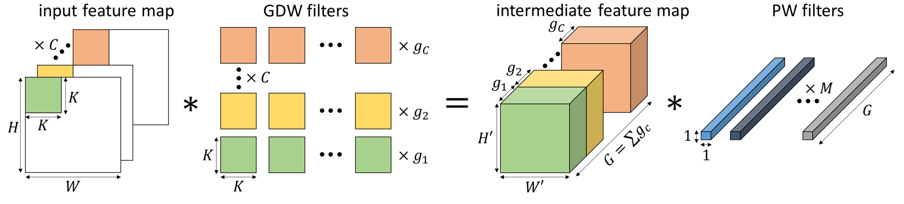
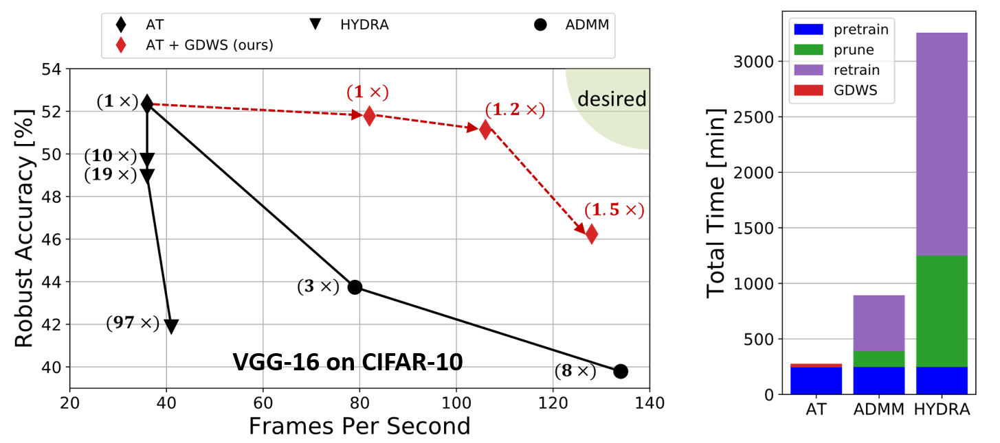

# Generalized Depthwise-Separable Convolutions for Adversarially Robust and Efficient Neural Networks

This repository contains the code and pre-trained models for our paper [Generalized Depthwise-Separable Convolutions for Adversarially Robust and Efficient Neural Networks](https://arxiv.org/abs/2110.14871) by Hassan Dbouk and [Naresh R. Shanbhag](http://shanbhag.ece.illinois.edu/) (NeurIPS 2021 Spotlight).


## What is GDWS?

Generalized Depthwise-Separable (GDWS) convolutions, as the name suggests, generalize the popular DWS convolutions by allowing for more than one depthwise kernel per input channel as seen below. In our work, we provide **efficient** and **theoretically optimal** approximation algorithms that allow us to approximate any standard 2D convolution with a GDWS one. Doing so, we can construct GDWS networks from pre-adversarially trained CNNs in order to dramatically improve the real hardware FPS (measured on an NVIDIA Jetson Xavier) while preserving their robust accuracy. Furthermore, GDWS easily scales to large problem sizes since it operates on pre-trained models and doesn't require any additional training.

<p>

</p>


## Performance Summary

Recent robust pruning works [HYDRA](https://github.com/inspire-group/hydra) and [ADMM](https://github.com/yeshaokai/Robustness-Aware-Pruning-ADMM) achieve high compression ratios but either _fail_ to achieve high FPS measured on an NVIDIA Jetson Xavier or _compromise_ significantly on robustness. Furthermore, the overreliance of current robust complexity reduction techniques on adversarial training (AT) increases their training time significantly as shown below. Thus, there is critical need for methods to design deep nets that are both adversarially robust and achieve high throughput when mapped to real hardware. To that end, we:

* propose GDWS, a novel convolutional structure that can be seamlessly mapped onto off-the-shelf hardware and accelerate pre-trained CNNs significantly while maintaining robust accuracy.
* show that the error-optimal and complexity-optimal GDWS approximations of any pre-trained standard 2D convolution can be obtained via greedy polynomial time algorithms, thus eliminating the need for any expensive training.
* apply GDWS to a variety of networks on CIFAR-10, SVHN, and ImageNet to simultaneously achieve higher robustness _and_ higher FPS than existing robust complexity reduction techniques, while incurring no extra training cost.
*  perform thorough experiments using four network architectures on CIFAR-10, SVHN, and Imagenet, and demonstrate the effectiveness of GDWS as it outperforms existing techniques in terms of robustness and throughput (measured in FPS). We also show that model compression is not always the answer when high throughput is required.
*  demonstrate the versatility of GDWS by using it to design efficient CNNs that are robust to union of (*l<sub>&infin;</sub>*,*l<sub>2</sub>*,*l<sub>1</sub>*) perturbation models. To the best of our knowledge, this is the first work that proposes efficient and robust networks to the union of norm-bounded perturbation models.

<p>

</p>


## What is in this Repo?
We provide a PyTorch implementation of our GDWS convolutions and our optimal approximation algorithms MEGO and LEGO (algorithms 1 & 2 from our [paper](https://arxiv.org/abs/2110.14871)). We also provide a modified script from [this repo](https://github.com/charbel-sakr/Precision-Analysis-Pytorch) for computing the per-layer weight error vectors `alpha` (equation (8) from our [paper](https://arxiv.org/abs/2110.14871)). The code provided can be used to approximate any pre-trained CNN via GDWS convolutions and evaluate its robustness against *l<sub>&infin;</sub>*-bounded perturbations via `eval_robustness.py`.

## Example
This code was run with the following dependencies, make sure you have the appropriate versions downloaded and installed properly.
 ```
python 3.6.9
pytorch 1.0.0
numpy 1.18.1
torchvision 0.2.1
```
1.  clone the repo: `git clone https://github.com/hsndbk4/GDWS.git`
2.  make sure the appropriate dataset folders are setup properly (check `get_dataloaders` in `datasets.py`)
3.  download a pre-trained pre-activation resnet-18 on CIFAR-10 and its pre-computed weight error vectors `alpha` from [here](https://uofi.box.com/s/b6jm8q1qi1xufyrxt541972p6q4s6ago)
4.  place both files in an appropriate folder in the root directory, e.g. `outdir_cifar10/preactresnet18`

We are now set to run some scripts. First, let us check the natural and robust accuracies of our pre-trained baselines by running the following two commands:
```
python eval_robustness.py --model preactresnet18 --fname "outdir_cifar10/preactresnet18" --dataset cifar10 --attack none --logfilename a_nat_base.txt
python eval_robustness.py --model preactresnet18 --fname "outdir_cifar10/preactresnet18" --attack-iters 100 --pgd-alpha 1 --dataset cifar10 --epsilon 8 --logfilename a_rob_base.txt
```
The accuracy numbers will be stored in the appropriate text files in the same folder. Similarly, let us replace the convolutional layers with GDWS ones, using the LEGO algorithm  with `beta=0.005`, and evaluate both the natural and robust accuracies:
```
python eval_robustness.py --model preactresnet18 --fname "outdir_cifar10/preactresnet18" --dataset cifar10 --attack none --logfilename a_nat_gdws.txt --apply-gdws --alphas-filename alphas.pth --beta 0.005
python eval_robustness.py --model preactresnet18 --fname "outdir_cifar10/preactresnet18" --attack-iters 100 --pgd-alpha 1 --dataset cifar10 --epsilon 8 --logfilename a_rob_gdws.txt --apply-gdws --alphas-filename alphas.pth --beta 0.005
```


## Citation

If you find our work helpful, please consider citing it.
```
@article{dbouk2021generalized,
  title={Generalized Depthwise-Separable Convolutions for Adversarially Robust and Efficient Neural Networks},
  author={Dbouk, Hassan and Shanbhag, Naresh R.},
  journal={Advances in Neural Information Processing Systems},
  year={2021}
}
```

## Acknowledgements

This work was supported by the Center for Brain-Inspired Computing (C-BRIC) and the Artificial Intelligence Hardware (AIHW) program funded by the Semiconductor Research Corporation (SRC) and the Defense Advanced Research Projects Agency (DARPA).

Parts of the code in this repository are based on following awesome public repositories:

* [https://github.com/locuslab/robust_overfitting](https://github.com/locuslab/robust_overfitting)
* [https://github.com/charbel-sakr/Precision-Analysis-Pytorch](https://github.com/charbel-sakr/Precision-Analysis-Pytorch)
* [https://github.com/gmh14/RobNets](https://github.com/gmh14/RobNets)
